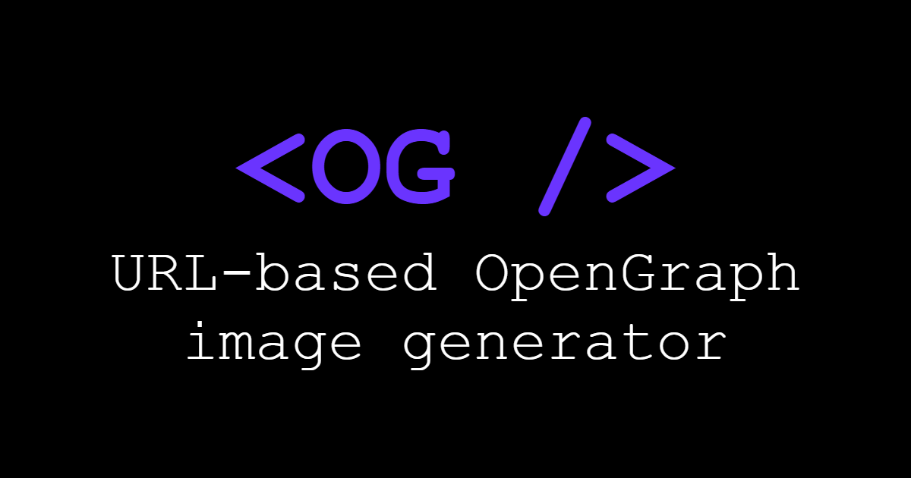

 
    <h1> < OG /> </h1>
    

## Description
**\<OG/>** is a OpenGraph image generator made for creating dynamically generated images specifically designed for using in `<meta>` tags in an HTML header.

You can pass different contents via URL-params while making the request, creating the image in that moment. And making it ideal for usage in a multitude of projects.

## Parameters
The parameters accepted currently are:
| Name                | Description | Examples | Defaults |
| ----                | ----------- | -------- | -------- |
| **backgroundColor** | Accepts any valid CSS color | black,   #fff,   rgba(255,25,98) | black |
| **title**           | Any string. As a URL-param, you might need to parse it previously | This is a title,  \<OG />,   🔥 | Untitled |
| **titleColor**      | Same as backgroundColor | Same as backgroundColor | white
| **text**            | Same as title | This is a subtitle,   I can explain more in-depth what this is about | - |
| **textColor**       | Same as backgroundColor | Same as backgroundColor | white |
| **font**            | Any valid CSS font-family | Arial,   monospace,   Impact | sans-serif |

## Examples
Assuming the project is hosted at `localhost:5000`, then you can use it like this:

If you pass nothing you get something like this:
> 
https://localhost:5000/api/

>
>[<button >Try it here</button>](http://localhost:5000/api/)

URL used to generate this repo's image.
> http://localhost:5000/api/? `backgroundColor=black`&`title=<OG />`&`titleColor=%236a34fe`&`text=URL-based OpenGraph image generator`&`textColor=white`&`font=Monospace`
>
>[<button >Try it here</button>](http://localhost:5000/api/?backgroundColor=%23000000&title=%3COG%20/%3E&titleColor=%236a34fe&text=URL-based%20OpenGraph%20image%20generator&textColor=%23ffffff&font=Monospace)

(Characters like `#` need to be parsed to be sent properly)
